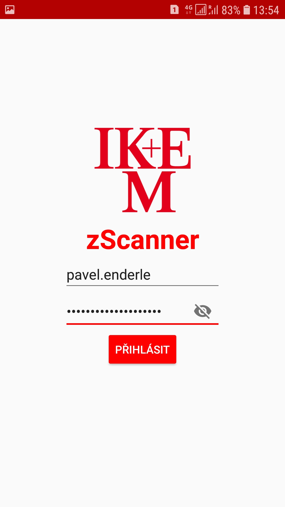
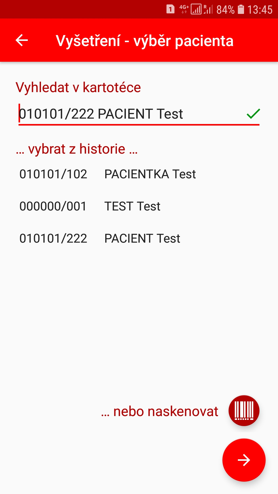
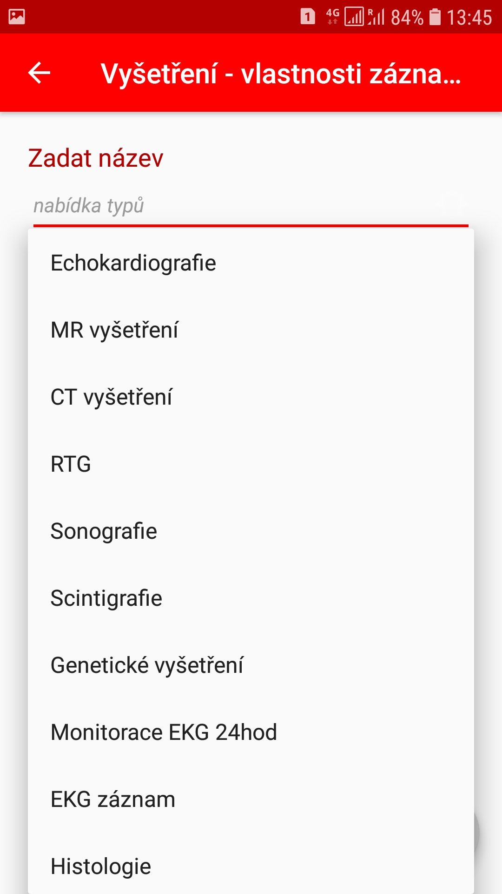
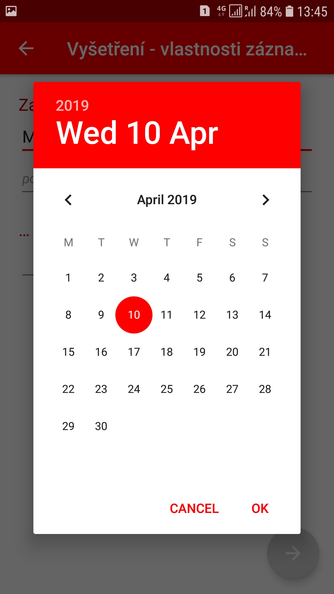
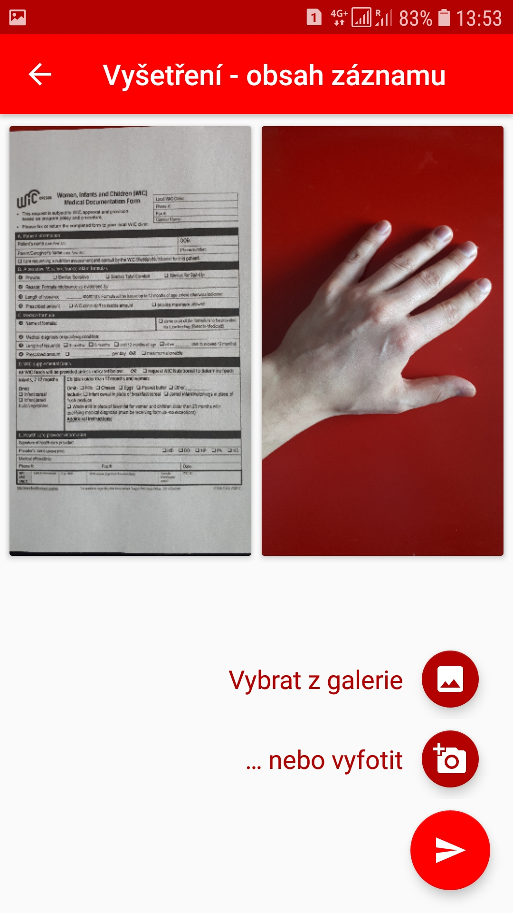
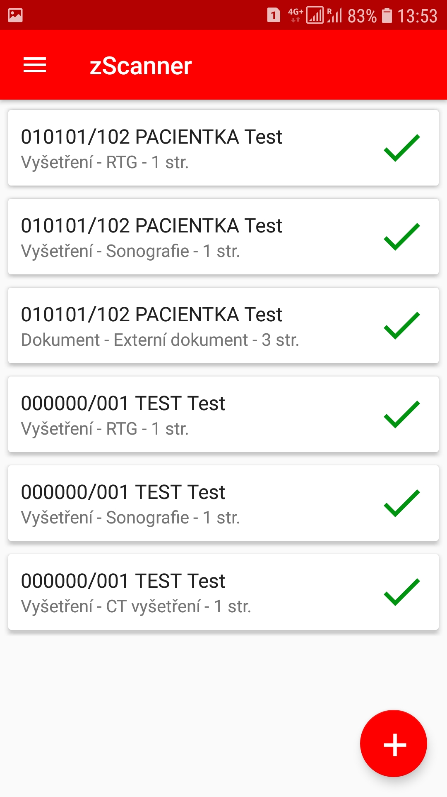

# zScanner for Android (by IKEM)

zScanner is a mobile application for clinical and medical photo documentation.
zScanner enables doctors to take photos of patient medical records, and of injuries of the patients, and upload them to a hospital information system.
zScanner is an application developed and used by [IKEM](https://www.ikem.cz/en/), a major Czech hospital, and the largest center of clinical and experimental medicine in the Czech Republic. 
IKEM decided to release this application as an open-source project under MIT licence.

|   |  |  |
|:---:|:---:|:---:|
|  |  |  |

For more details, [continue here](https://teskalabs.com/blog/zscanner-mobile-app-for-medical-photo-documentation).

This open-source project is operated with the help of [TeskaLabs](https://teskalabs.com/).
